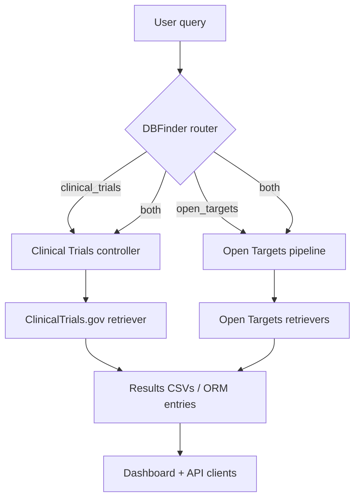

# GRID Biomedical Intelligence Platform

The GRID project combines a suite of Python agents for biomedical knowledge discovery with a modern Django web dashboard. Queries
are classified by an LLM router, parsed into structured entities, normalized against biomedical identifiers, and fanned out to
Open Targets and ClinicalTrials.gov retrievers. Results can be explored programmatically or through the responsive GRID Insights
web experience.

## System overview

1. **Routing** – `main.DBFinder` uses an Ollama-hosted `gemma2` model to decide whether a free-text question should be sent to
the Clinical Trials, Open Targets, or both agent pipelines.
2. **Parsing & normalization** – Each pipeline calls bespoke LangChain-based parsers under `query_parser/` and enriches the
entities with ontology identifiers via the helpers in `normalizer/`.
3. **Retrieval & ranking** – The retrievers in `retriever/` orchestrate API calls to Open Targets GraphQL and ClinicalTrials.gov,
then post-process and rank evidence before persisting CSV outputs with `utils.helpers`.
4. **Presentation** – The Django app in `webapp/` persists user queries, executes them asynchronously through Celery workers,
and renders the history, live task status, and authentication screens with an updated Bootstrap 5 interface.

The repository therefore supports both headless automations (via the Python agents) and an interactive experience for research
teams.

## Repository layout

| Path | Description |
|------|-------------|
| `main.py` | Entry point that exposes the `DBFinder` LLM router used by both the CLI loop and Django services. |
| `Clinical_Trials_Controller_Agent*.py` | Controller orchestrators that parse queries and run the clinical trials retriever. |
| `open_targets*.py` | Pipelines that normalize entities and query Open Targets datasets, saving ranked CSV summaries. |
| `query_parser/` | LangChain prompt chains that convert natural-language queries into structured JSON payloads. |
| `normalizer/` | Identifier lookup helpers (ZOOMA, ChEMBL, Ensembl) that enrich parsed terms before retrieval. |
| `retriever/` | Data-access layers for ClinicalTrials.gov and Open Targets including ranking/merging logic. |
| `utils/` | Shared helper utilities such as CSV persistence. |
| `webapp/` | Django project with Celery integration, ORM models, templates, and static assets for the GRID Insights UI. |
| `requirements.txt` | Consolidated Python dependencies for the agents and the Django stack. |

> **Note:** The `*_copy.py` modules mirror their counterparts with the same public functions. They are retained for backwards
compatibility while the agents are refactored; new integrations should prefer the non-`_copy` modules.

## Data flow at a glance



## Setting up the environment

### Prerequisites

- Python 3.11+
- [Ollama](https://ollama.com/) with the `gemma2` family pulled locally (`ollama pull gemma2`)
- Redis 5+ for Celery message brokering
- Optional: Docker if you prefer containerized execution

Install dependencies once the prerequisites are available:

```bash
python3 -m venv .venv
source .venv/bin/activate
pip install --upgrade pip
pip install -r requirements.txt
```

## Running the agent pipelines from the CLI

1. Ensure Ollama, Redis, and any required external services are running.
2. Start an interactive routing session:

   ```bash
   python main.py
   ```

   The prompt loops until you type `exit`, classifying each question and delegating to the appropriate pipeline.
3. CSV outputs are written under the `output/` directory by the retrievers for later analysis.

You can also call individual controllers directly, for example:

```bash
python Clinical_Trials_Controller_Agent.py
python open_targets.py
```

Each script prompts for input (or uses the hard-coded sample) and prints a Rich-rendered summary of the retrieved results.

## Running the GRID Insights web application

1. Apply database migrations and create a superuser if needed:

   ```bash
   python webapp/manage.py migrate
   python webapp/manage.py createsuperuser
   ```

2. Launch the Celery worker in one terminal:

   ```bash
   CELERY_BROKER_URL=redis://localhost:6379/0 \
   CELERY_RESULT_BACKEND=redis://localhost:6379/0 \
   celery -A gridsite worker --loglevel=info
   ```

3. Start the Django development server in another terminal:

   ```bash
   python webapp/manage.py runserver 0.0.0.0:8000
   ```

4. Navigate to <http://localhost:8000> to access the redesigned dashboard featuring live query status, collapsible history,
   and modernized authentication flows.

### Docker option

A Dockerfile is available to provision Ollama, Redis, Celery, and Django automatically:

```bash
docker build -t grid-webapp .
docker run -p 8000:8000 \
  -e CELERY_BROKER_URL=redis://localhost:6379/0 \
  -e CELERY_RESULT_BACKEND=redis://localhost:6379/0 \
  grid-webapp
```

Set `CELERY_TASK_ALWAYS_EAGER=true` when experimenting without background workers.

## Testing & quality checks

The repository currently provides Django system checks and relies on integration tests exercised by the pipelines. After
installing Django locally you can run:

```bash
python webapp/manage.py check
```

Additional unit tests can be added under `webapp/apps/queries/tests/` and alongside the agent modules as the project evolves.

## Troubleshooting tips

- **Router import errors in Django** – Ensure the repository root (containing `main.py`) is on `PYTHONPATH`. The app handles this
  automatically, but custom scripts may need to export `PYTHONPATH=$PWD`.
- **External API rate limits** – Both ClinicalTrials.gov and Open Targets enforce rate limiting. Implement caching or retries if
you plan to run batch jobs.
- **Ollama availability** – The LLM router, parsers, and controllers expect an accessible Ollama endpoint serving `gemma2`. Start
the server (`ollama serve`) before invoking the agents or Celery workers.
